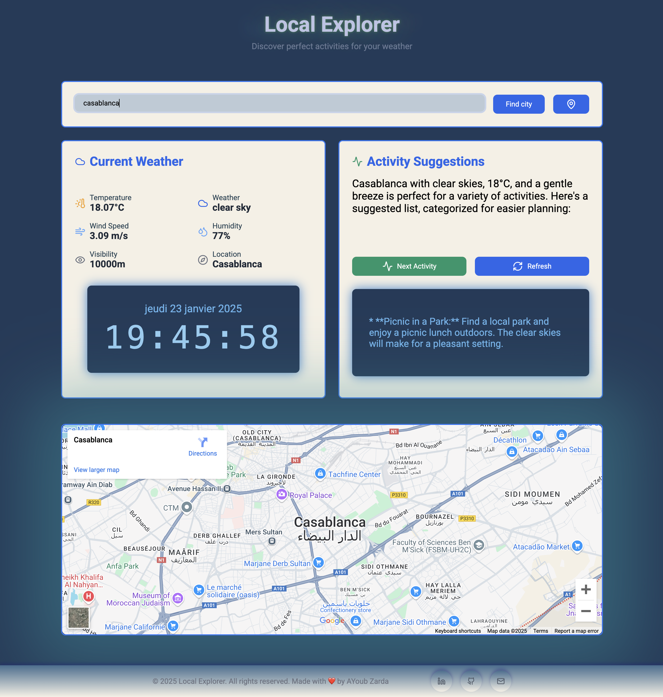

 # Local Explorer 🌍

Local Explorer est une application web intelligente et intuitive qui vous aide à découvrir les meilleures activités en fonction de votre localisation, de la météo et de l'heure. Que ce soit pour une journée ensoleillée au parc ou une soirée pluvieuse dans un café cosy, Local Explorer vous propose des suggestions personnalisées en temps réel. Avec des réservations faciles et des recommandations qui s'adaptent à vos préférences, c'est comme avoir un concierge personnel dans votre poche.

 # 🚀 Aperçu du projet

Local Explorer est une application web sophistiquée, pilotée par l'IA, qui fournit des recommandations d'activités personnalisées en fonction de :

Votre localisation actuelle.

Les conditions météorologiques en temps réel.

L'heure de la journée.

L'objectif est de créer une expérience utilisateur fluide et engageante, en proposant des activités adaptées à chaque moment de la journée, qu'il fasse beau ou mauvais.

 # ✨ Fonctionnalités principales
 ### Intégration de la géolocalisation et des données météo :

Utilisation de la géolocalisation du navigateur pour identifier la position de l'utilisateur.

Intégration de l'API OpenWeatherMap pour obtenir les conditions météorologiques en temps réel.

 ### Suggestions d'activités pilotées par l'IA :

Utilisation de l'API Gemini pour générer des suggestions d'activités adaptées à la météo et à l'heure.

Activités variées, incluant des options en extérieur et en intérieur.

 ### Intégration de Google Maps :

Affichage votre lieux  sur une carte interactive.

 ### Suggestions dynamiques et uniques :

Les activités ne sont jamais répétées.

Mise à jour dynamique des recommandations en fonction des interactions de l'utilisateur.

 ### Interface utilisateur intuitive :

Conception d'une interface swipe-based (ou basée sur des boutons) pour une navigation facile.

Design accessible et engageant, adapté à tous les niveaux de compétence technologique.

Transitions fluides et éléments visuels attrayants pour une expérience utilisateur optimale.

# 🛠️ Installation et utilisation

Prérequis:

**Docker**

**Docker Compose**

 ### Étapes d'installation

Clonez ce dépôt :

    git clone https://github.com/votre-utilisateur/local-explorer.git
    cd local-explorer

 ### Configurez les variables d'environnement :

Créez un fichier .env à la racine du projet et ajoutez-y les clés API suivantes :

    VITE_WEATHER_API_URL=https://api.openweathermap.org/data/2.5/weather
    VITE_WEATHER_API_KEY=votre_clé_api_openweathermap

    VITE_ACTIVITY_API_URL=https://generativelanguage.googleapis.com/v1beta/models/gemini-1.5-flash:generateContent
    VITE_ACTIVITY_API_KEY=votre_clé_api_gemini

 ## Obtenez vos clés API :

 #### OpenWeatherMap :

Rendez-vous sur  [OpenWeatherMap API](https://home.openweathermap.org/api_keys)  .

Créez un compte gratuit ou connectez-vous.

Allez dans votre tableau de bord et générez une clé API.

Utilisez cette clé pour VITE_WEATHER_API_KEY dans le fichier .env.

#### Gemini :

Rendez-vous sur [Google AI Studio](https://aistudio.google.com/apikey) .

Connectez-vous avec votre compte Google.

Créez un nouveau projet ou utilisez un projet existant.

Générez une clé API pour Gemini.

Utilisez cette clé pour VITE_ACTIVITY_API_KEY dans le fichier .env.

# Pour exécuter mon projet

### Lancez les conteneurs Docker :
    make all

### Lancer l'application en mode détaché :

    make detach
### Arrêter les conteneurs :

    make down
### Nettoyer les conteneurs et les images :
    make clean
### Nettoyer complètement le projet :
    make fclean
### Relancer l'application après un nettoyage :

    make re

# 🗂️ Structure du projet
app/ : Code source de l'application React.

certs/ : Certificats SSL générés pour Nginx.

nginx.conf : Configuration du serveur Nginx.

docker-compose.yml : Configuration Docker Compose pour les services.

Makefile : Commandes simplifiées pour gérer Docker.

.env : Fichier de configuration des variables d'environnement (clés API, URLs, etc.).

 # 🔧 Rôle de Nginx
## Nginx est utilisé dans ce projet pour :

### Rediriger le trafic HTTP vers HTTPS :

Assure que toutes les connexions non sécurisées (HTTP) sont redirigées vers une connexion sécurisée (HTTPS).

### Gérer les connexions HTTPS :

Sécurise les communications entre le client et le serveur en utilisant des certificats SSL.

Proxyfie les requêtes vers l'application React qui tourne sur le port 3000.

### Améliorer les performances :

Agit comme un serveur web léger et performant pour servir les fichiers statiques et gérer les requêtes.

# 📸 Captures d'écran 

## Auteurs
- [Github](https://github.com/AyoubZarda/)
- [Linkedin](https://www.linkedin.com/in/zarda-ayoub/)

## Contact
Pour toute demande ou problème, veuillez contacter AYoub Zarda en zardaayoub1@gmail.com.